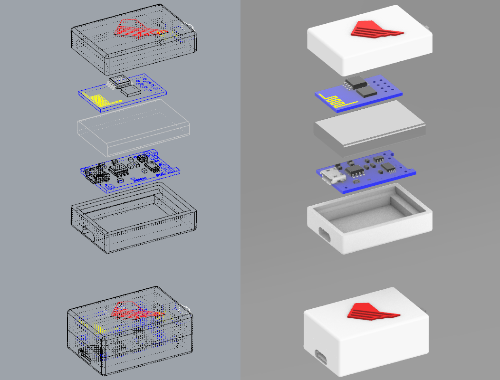
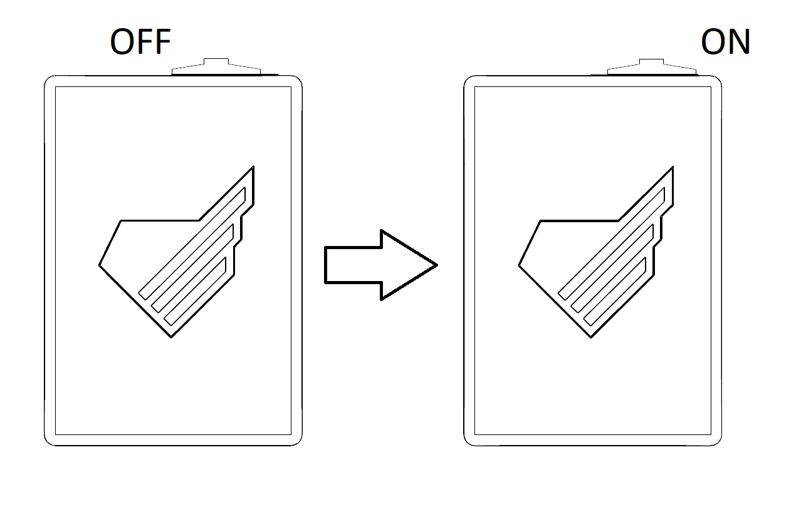

# CV SERVER

This project was created as a supplement to my job application as a Junior QA Engineer at Monterail.
It's purpose it to deliver fully functional web server in smallest form factor possible.

## Hardware
1. ESP8266 WiFi SoC module - ESP-01S
2. Winbond 25Q32BVSIG 4MB Flash memory chip
3. TP4056 Lithium Battery Charger and Protection Module
4. 250mAh 3.7V Lithium Polymer Mini Rechargeable Battery
5. Bistable slide switch

## Embedded Software
The software running the webserwer was written using Arduino in PlatformIO environment.

In order to build the software run the following command inside the terminal form the esp8266 folder:
```
platformio run --target upload
```
After building the frontend (covered later) run the following command to put the data inside of the chip's filesystem.
```
platformio run --target uploadfs
```

## Frontend
The frontend was written using Preact.js – fast React.js alternative with small code footprint.
Because the device is battery-driven it was decided to not use any lazy loading. Upon request the user is provided with index.html which in turn requests bundle file. The bundle file was compressed using gzip.

The only files not bundled inline are the PDFs with CV which are, because of their size, loaded only upon explicit request.

In order to build the frontend run the following from the terminal inside the root of the document:
```
npm install
npm run build
```

## Case
The case for the server was designed in Rhino3d software and 3D printed on Creality Ender3 3D printer.



## Instructions

### HOW TO USE “CV SERVER”
1.  Turn the device on by sliding the switch outwards.



2.  Connect to “Jan Chodorowski” Access Point using either mobile device or computer.
3.  Open favorite web browser.
4.  Ignore the “no Internet” alerts if any.
5.  Navigate to 192.168.4.1.
6.  After using the device turn it off by reversing step 1.

*When navigating to github via link user will be informed of the need of connecting to the WiFi with the access to the Internet.


### IN CASE OF RUNNING OUT OF BATTERY

1.  Make sure the power switch is in the OFF position.
2.  Connect provided microUSB cable to the device.
3.  Connect the cable to 5V power source.
4.  Wait until the red light on the bottom of the device turns blue indicating fully charged battery.
5.  Disconnect the cable form the power source and the device.

